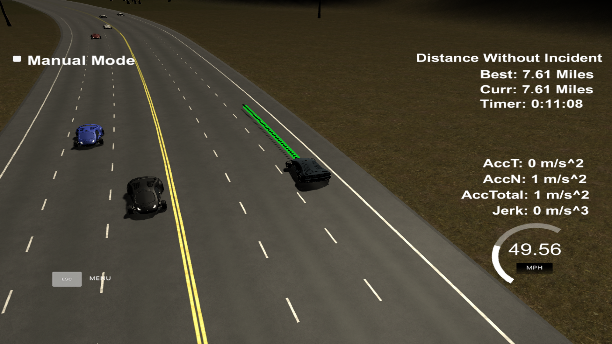

# Path Planning Project
---
The goals / steps of this project are the following:
* Implement a path planning algorithm and finite state machine
* Use localization and sensor fusion data and waypoints to plan a safe path in traffic at 50mph
* Develop an understanding of Frenet coordinates and use them to perform maneuvers (e.g. lane switches)
* Use the simulator to test the path planning algorithm and finite state machine
* Summarize the results with a written report

---
## Project Overview
This project utilizes a Frenet coordinates, a finite state machine, and a spline object to plan the path of the autonomous car in the simulator.

* `main.cpp` - communicates with the simulator, contains the finite state machine and generates a path using localization and sensor fusion data
* `helpers.h` - contains useful functions for the path planning implementation
* `spline.h` - imported spline object to create smooth trajectories using points
* `json.hpp` - imported default JSON file format

### Constraints during Design
* Drives over 5 miles without any incidents
* Stays below the speed limit of 50 mph
* Limits total acceleration and jerk below 10 m/s^2 and 10 ms^3 respectively
* No collisions with other traffic
* Stays in its lane unless lane changing (taking < 3s to change lanes)
* Changes lanes when traffic is slow and a nearby lane is free

### Finite State Machine
| State 0 | State 1 | State 2 |
|---|---|---|
| When there is no car ahead, the car will accelerate to its max speed | Vehicle is following the car ahead without tailgating | Prepare to switch lanes and checking for gaps in traffic |

* State 0 -> State 1: Car is spotted within 40 meters ahead of the car in the current lane
* State 1 -> State 2: Car in front is slow
* State 2 -> State 0: Successfully changed lanes

A lane change is performed when there are no cars within 30m to the left and/or right lane of the current car's lane. The speed of the adjacent lanes' traffic ahead determines the lane to change to if both have a sufficient gap in traffic. Additionally, a delay is implemented to prevent consecutive lane changes from occuring too quickly.

### Path Generation
First, vectors `ptsx` and `ptsy` were created to store the to-be-generated path. 
They use the last two coordinates from the remaining path from the previous iteration. Then, the (x,y) coordinates are transformed into Frenet (s,d) coordinates for a simpler analysis.

A spline (from `spline.h`) is used to create a smooth path in Frenet coordinates using the transformed points. By interpolating the distance between initial and final points, an approximate velocity can be calculated (as successive points are executed at 50 Hz).

Finally, the points are converted back to cartesian coordinates to match the global map. 50 points in total are generated (after including the previous remaining path's residual points). This is then sent to the simulator through JSON files for the car to execute the positions based on the generated path.

An example of the path planning algorithm in action within the simulator is shown below:

Safely driving for more than 7.5 miles:



The complete video can be downloaded [here](media/output.mp4). Please take note that I speed up the video 2x.

---
## Try it yourself!

1. Clone this repo.
2. Make a build directory: `mkdir build && cd build`
3. Compile: `cmake .. && make`
4. Run it: `./path_planning`.

Here is the data provided from the Simulator to the C++ Program

### Simulator.
You can download the Simulator which contains the Path Planning Project from the [releases tab (https://github.com/udacity/self-driving-car-sim/releases/tag/T3_v1.2).  

To run the simulator on Mac/Linux, first make the binary file executable with the following command:
```shell
sudo chmod u+x {simulator_file_name}
```
### Dependencies

* cmake >= 3.5
  * All OSes: [click here for installation instructions](https://cmake.org/install/)
* make >= 4.1
  * Linux: make is installed by default on most Linux distros
  * Mac: [install Xcode command line tools to get make](https://developer.apple.com/xcode/features/)
  * Windows: [Click here for installation instructions](http://gnuwin32.sourceforge.net/packages/make.htm)
* gcc/g++ >= 5.4
  * Linux: gcc / g++ is installed by default on most Linux distros
  * Mac: same deal as make - [install Xcode command line tools]((https://developer.apple.com/xcode/features/)
  * Windows: recommend using [MinGW](http://www.mingw.org/)
* [uWebSockets](https://github.com/uWebSockets/uWebSockets)
  * Run either `install-mac.sh` or `install-ubuntu.sh`.
  * If you install from source, checkout to commit `e94b6e1`, i.e.
    ```
    git clone https://github.com/uWebSockets/uWebSockets 
    cd uWebSockets
    git checkout e94b6e1
